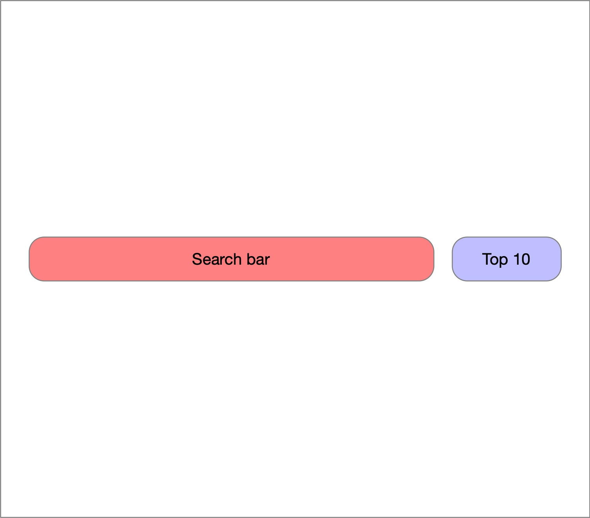
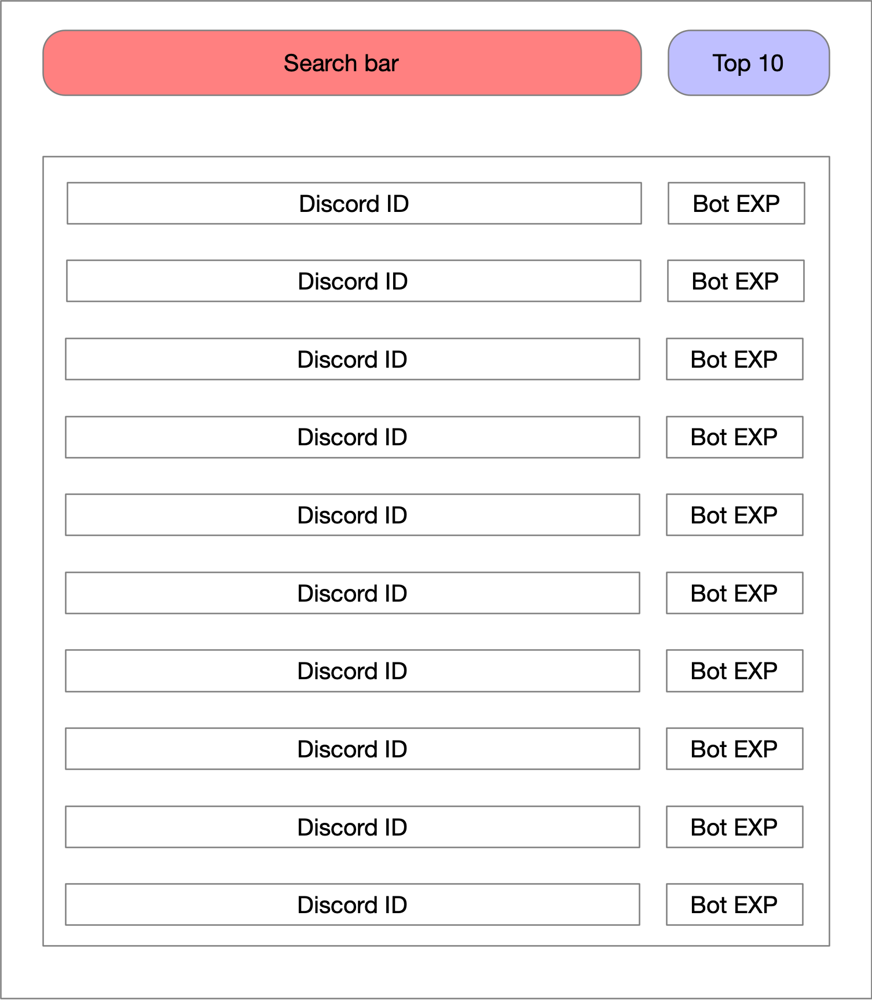
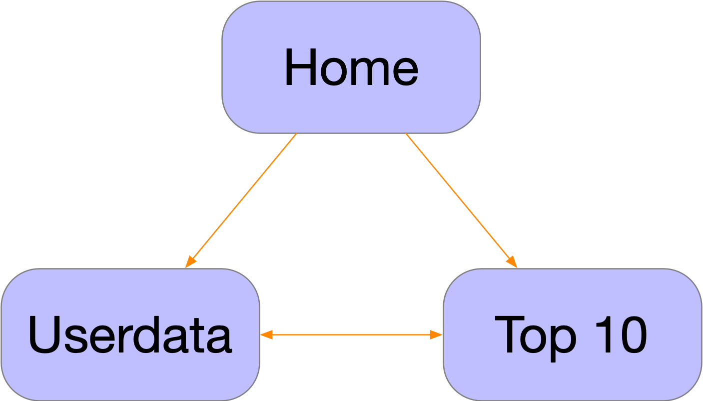

# Index
- [Information](#Information)
	- [General concept](#General-concept)
- [Functional design](#Functional-design)
	- [Functionalities](#Functionalities)
	- [Website interface](#Website-interface)
	- [Website flowchart](#Website-flowchart)
- [Techincal Design](#Technical-design)
	- [Resources](#Resources-needed-for-this-project)
	- [Target platform](#Target-platform)
	- [Technical information](#Technical-information)

## Information
### General concept

This project will be an API for my bot that is in progress. This will make it possible to get your general statistics from your user ID which can be the ID that my bot created or the ID that you have on Discord. 
The Idea was to make this project on a website so people can access their public data and that there will be an easy website viewer for the end user that doesn't know how to read such data.

## Functional design
### Functionalities
| Functionality | Usage |
| :----- | :-----: |
| Requesting your data | Input your Discord/bot ID |
| Requesting the top 10 | Select the top button |

### MoSCoW
- Must have:
	- A backend that can present you the data
	- A top 10 list
- Should have:
	- A frontend for a enduser that doesn't know how to interpret the data
- Could have:
	- An image output for the rank
	- Login with Discord
- Won't have:
	- 

### Website interface

#### The data that will be presented in the interface
- Discord ID
- Bot ID
- Bot EXP (Experience)
- Bot rank (Your position in the bot list calculated from highest experience)
- Title (A title that the user can fill in)
- Description (Description of a user)

There will be an data only webfront that will give you an json output.
The other one will shows the end user their data visually. 
Both are also able to show the top 10 users of all my data. The top 10 is calculated from your experience.

#### Wireframe
**Legenda**
| Color | function |
| :-----: | :-----: |
| Red | Input field |
| Blue | Button |
| White | Text fields |

**Main page/data page**

**Top 10 page**

### Website sitemap

## Technical design

### Resources needed for this project
- Developers. (That will code Python and mySQL)
- An code editor for Python like PyCharm or VisualStudioCode.
- A Laptop/PC.
- A capable webbrowser like Chrome, Firefox or Safari to test the website.
- A server which doesn't have to be a high end server, but it needs to be able to run the django basics. Not much storage is required either.

### Target platform
All platform should be supported that have an internet connection and an internet browser. This means it should work in any browser that is common. Mobile devices should also support.

### Technical information
#### Code language
Python 3.10
mySQL

#### Frameworks
Django ver 3.2 LTS

### Code Info

#### Classes

**MainClass**
- Will start to host the website
- Recieve all function from a requester

**WebConnector**
- Will send the data required to fill in recipients page
- Will send what data has been requested to the DataGrabber class

**DataGrabber**
- Grabs data from the database per user
- Grabs data from the database to create a top 10 and caches it for 10 mins after

**DataHandler**
- Format and interpret the data gotten from the DataGrabber class and send it 

