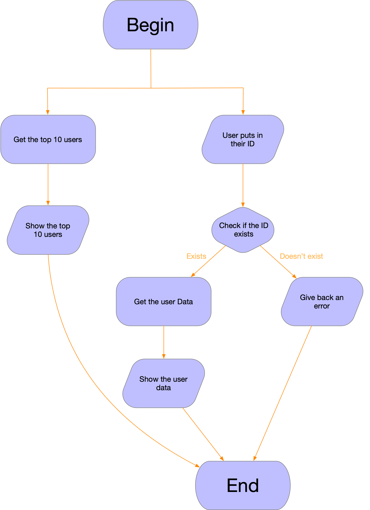

# Index
Doesn't work in the PDF, as it is made [github](https://github.com/IvoDeK/ilybot-api/blob/main/Docs/Ilybot-API-design-document.md) complient  
- [Information](#Information)
	- [General concept](#General-concept)
- [Functional design](#Functional-design)
	- [Functionalities](#Functionalities)
	- [MoSCoW](#MoSCoW)
	- [Use case diagram](#Use-case-diagram)
	- [Use case description](#Use-case-description)
	- [Website interface](#Website-interface)
	- [Website flowchart](#Website-flowchart)
- [Techincal Design](#Technical-design)
	- [Resources](#Resources-needed-for-this-project)
	- [Target platform](#Target-platform)
	- [Technical information](#Technical-information)
	- [Flowchart](#flowchart)
	- [Code Information](#code-info)
	- [Rational datamodel](#Rational-datamodel)

## Information
### General concept

This project will be an API for my Discord bot that is in progress. The Discord bot creates data from usages with the bot. For example you get experience from chatting in Discord where the bot is in. For each message you get a random amount between 5 and 15. By this you can show someone how active you are on Discord. This will make it possible to get your general statistics from your user ID which can be the ID that my bot created or the ID that you have on Discord. 
The Idea was to make this project on a website so people can access their public data and that there will be an easy website viewer for the end user that doesn't know how to read such data.

## Functional design
### Functionalities
| Functionality | Usage |
| :----- | :-----: |
| Requesting your data | Input your Discord/bot ID |
| Requesting the top 10 | Select the top button |

### MoSCoW
- Must have:
	- A backend that can present you the data
	- A top 10 list
- Should have:
	- A frontend for a enduser that doesn't know how to interpret the data
- Could have:
	- An image output for the rank
	- Currency showcase
- Won't have:
	- Login with Discord

### Use case diagram

### Use case description 
| Name | Ilybot API |
| :--- | --- |
| Actors | User Server |
| Assumptions | - A device that the user has to visit the website   - They have an internet connection   - The actor has a browser   - Website needs to be online |
| Desciption | 1. The user goes to the site  2. The user requests their data  3. The server recievies the data from the database  4. The user recieves the information from the server |
| Exceptions | No exceptions |
| Result | The user will recieve their data from the database in their webclient |

### Website interface

#### The data that will be presented in the interface
- Discord ID
- Bot ID
- Bot EXP (Experience)
- Bot rank (Your position in the bot list calculated from highest experience)
- Title (A title that the user can fill in)
- Description (Description of a user)

There will be an data only webfront that will give you an json output.
The other one will shows the end user their data visually. 
Both are also able to show the top 10 users of all my data. The top 10 is calculated from your experience.

#### Wireframe
**Legend**

| Color | function |
| :-----: | :-----: |
| Red | Input field |
| Blue | Button |
| White | Text fields |

**Main page**

**Data page**

**Top 10 page**

### Website sitemap

### Flowchart
The basics of how the interaction will be with either the url bar ot the web interface

## Technical design

### Resources needed for this project
- Developers. (That will code Python and mySQL)
- An code editor for Python like PyCharm or VisualStudioCode.
- A Laptop/PC.
- A capable webbrowser like Chrome, Firefox or Safari to test the website.
- A server which doesn't have to be a high end server, but it needs to be able to run the django basics. Not much storage is required either.

### Target platform
All platform should be supported that have an internet connection and an internet browser. This means it should work in any browser that is common. Mobile devices should also support.

### Technical information
#### Code language
Python ver 3.10  
SQL

#### Frameworks
Django ver 3.2 LTS

#### Server information
This doesn't have to be a powerfull server.
Testing will be done locally
The server will have a Apache backend with LAMP
The database is already hosted elsewhere with PHPMyAdmin

### Code Info

#### Views

**API view**
- Gets data from the actual database
	- Setup the Database in config files with a user that only has read permissions.
	- Test connections
	- Fetch top 10 with queries 
	- Fetch user by Discord/bot ID with queries
	- Packs everything into a json so it can be send to end user

**Main view**
- Gets data from the API view
	- Asks data from the API
	- Webfront
		-  Create the template HTML required for the website
		-  Functionalities to make the website work with the data

**Top10 view**
- Gets the top 10 data from API
	- Asks for date from API
	- Webfront
		-  Create the template HTML required for the website
		-  Functionalities to make the website work with the data

### Rational datamodel

|  | users |  |
| --- | :--- | :---: |
| Defenition | The table is used for finding a user |  |
| &nbsp; |	|
| **Table name** | **Datatype** | **Explenation** |
| ID | bigint(20) | This is the internal ID for finding other data |
| discordID | bigint(20) | This is the Discord ID to find them via Discord |
| premium | tinyint(1) | This variable is to see if the user has premium and can be used when there is a image output |
| blacklisted | tinyint(1) | See if the user is blacklisted and it will not show their data if true |
| enableNSFW | tinyint(1) | This is for background renders when images will be enabled |
| &nbsp;	|	|
| **Relations** | **Explenation** | |
| R1 | Connects the user table with the userStats table |
  

|  | userStats |  |
| --- | :--- | :---: |
| Defenition | The table is used to see their stats |  |
| &nbsp; |	|
| **Table name** | **Datatype** | **Explenation** |
| userID | bigint(20) | This is the internal ID to reference from user table  |
| exp | bigint(20) | This is the Discord ID to find them via Discord |
| expCooldown | bigint(20) | This variable is to see if the user has premium and can be used when there is a image output |
| title | varchar(50) | A title that the user can fill in |
| description | varchar(50) | Description of a user |
| rankImageID | bigint(20) | The image ID for the rank command unused in this api |
| profileImageID | bigint(20) | The image ID for the profile command which can be used for the image render |
| &nbsp;	|	|
| **Relations**| **Explenation** | |
| R1 | Connects the user table with the userStats table |